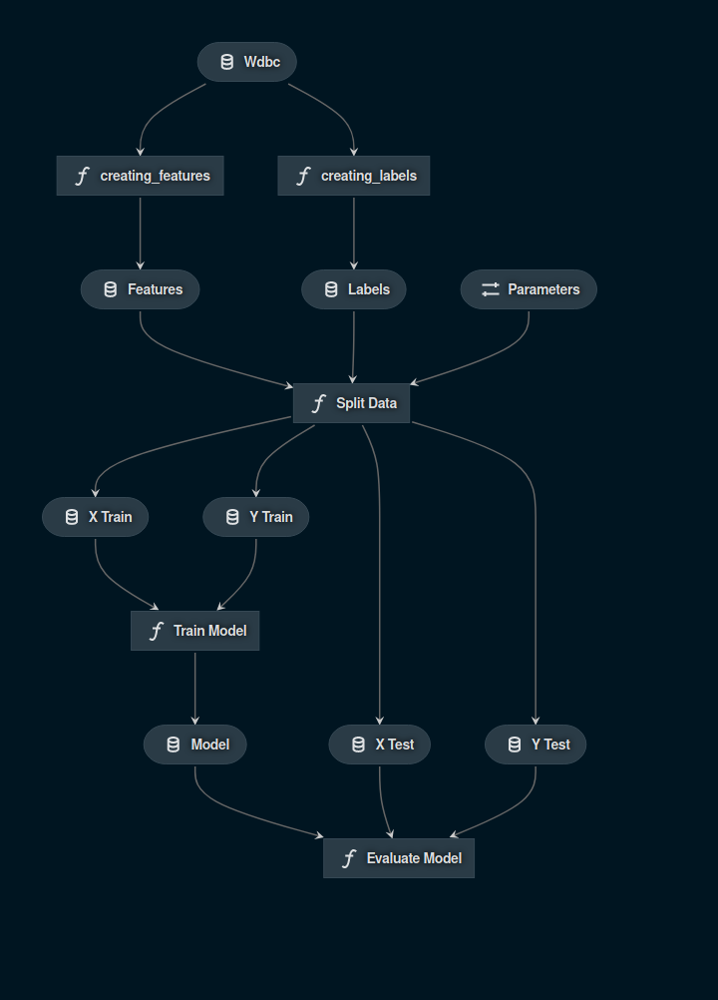

# Example for using Kedro for Tensorflow Models.
In this example I've used [wdbc](http://www.laurencemoroney.com/wp-content/uploads/2018/02/wdbc.csv)(Breast Cancer Dataset)
and used Tensorflow to train the model against the wdbc dataset.
All the Machine Learning WorkFlow is created by [kedro](https://github.com/quantumblacklabs/kedro)
### This Project is Created in [PyCon India 2020 Devsprint](https://in.pycon.org/blog/2019/understanding-devsprints.html).
## Machine Learning WorkFlow visualization created by ```kedro-viz```.

## Important Mention
This project wouldn't be possible without the constanst support of [Lais Carvalho](https://github.com/laisbsc)
